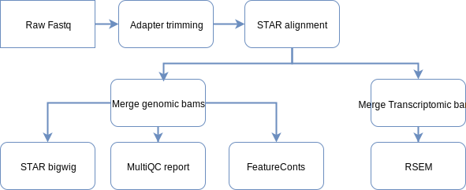
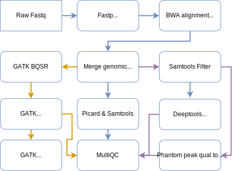

# Alignment QC
## Table of Contents
* [Overview](#overview)
* [QC of transcriptomic data](#qc-of-transcriptomic-data)
* [QC of genomic data](#qc-of-genomic-data)
* [Software and version information](#software-and-version-information)
  * [Command line](#command-line)
    * [Adapter trimming](#adapter-trimming)
    * [RNA-Seq alignment](#rna-seq-alignment)
    * [DNA-Seq alignment](#dna-seq-alignment)
    * [Post alignment processing](#post-alignment-processing)
      * [Add RG tags](#add-rg-tags)
      * [Mark duplicate reads](#mark-duplicate-reads)
    * [RNA-Seq signal](#rna-seq-signal)
    * [RNA-Seq gene count](#rna-seq-gene-count)
* [Output format](#output-format)
  * [Alignment file](#alignment-file)
  * [Gene count files](#gene-count-files)
  * [Signal files](#signal-files)
  * [MultiQC report](#multiqc-report)
* [List of resources](#list-of-resources)

## Overview
We process sequencing data through our QC pipeline and generate alignment quality report for a variety of assay types. Presently this option is only available for the Human samples.

## QC of transcriptomic data
Sequencing data for RNA-Seq samples are adapter trimmed using Fastp and mapped against a reference transcriptome using splice aware aligner STAR. We follow the _Alternate Protocol 7_ from [Mapping RNA-seq Reads with STAR](https://www.ncbi.nlm.nih.gov/pmc/articles/PMC4631051/) and generate a genomic bam and another transcriptomic bam after aligning fastq files from different lanes and flowcells. Each lane level bams are tagged with relevant read group information before they are merged together to create a library level bam followed by marking the duplicate reads (without removal) using Picard tool. We generate raw counts per gene using the FeatureCounts tool from the merged genomic bam and also normalised counts using RSEM tool utilising the merged transcriptome bam. A bigwig signal file is generated from the genomic bam file using STAR following the _Alternate Protocols 4_ from the above mentioned publication. All the Picard and Samtools metrics are merged using MultiQC for a library level report.

  

## QC of genomic data
Sequencing data for genomic samples are adapter trimmed using Fastp and mapped against a reference genome using alignment tool BWA. We follow GATK's [Data pre-processing for variant discovery](https://software.broadinstitute.org/gatk/best-practices/workflow?id=11165)  document and post process the aligned bam. Each lane level bams are tagged with relevant read group information before they are merged to a library level bam and duplicate reads are marked. We generate Picard and Samtools metrics for the library level bam and combine them using MultiQC.

  

## Software and version information
  * [Fastp v0.19.3](https://github.com/OpenGene/fastp)
  * [STAR v2.6.1c](https://github.com/alexdobin/STAR) 
  * [BWA vX](http://bio-bwa.sourceforge.net/)
  * [RSEM v1.3.1](https://deweylab.github.io/RSEM/)
  * [FeatureCounts vX](http://bioinf.wehi.edu.au/featureCounts/)
  * [Picard vX](https://broadinstitute.github.io/picard/command-line-overview.html)
  * [Samtools vX](http://www.htslib.org/)
  * [MultiQC v1.6](https://multiqc.info/)

### Command line
#### Adapter trimming

Tool name: __Fastp__

  <pre><code>
  fastp
    --in1 /path/input/sample.R1.fastq.gz
    --out1 /path/trimmed/sample.R1.fastq.gz
    --html /path/trimmed/sample.report.html
    --json /path/trimmed/sample.report.json
    --report_title sample
    --thread threads
    --in2 /path/input/sample.R2.fastq.gz
    --out2 /path/trimmed/sample.R2.fastq.gz
    --qualified_quality_phred=15
    --length_required=15
    --trim_poly_g         # for NEXTSEQ
  </code></pre>

#### RNA-Seq alignment

Tool name: __STAR__

  <pre><code>
  STAR
    --runThreadN threads
    --outFileNamePrefix /path/mapped/sample
    --outSAMattributes NH HI AS NM MD
    --runMode alignReads
    --outFilterType BySJout
    --quantMode TranscriptomeSAM GeneCounts
    --sjdbGTFfile gene.gtf
    --genomeLoad NoSharedMemory
    --outSAMunmapped Within
    --outSAMtype BAM SortedByCoordinate
    --genomeDir /path/star_ref_transcriptome
    --outFilterMultimapNmax 20
    --alignIntronMin 20
    --alignSJDBoverhangMin 1
    --outFilterMismatchNoverReadLmax 0.04
    --alignMatesGapMax 1000000
    --limitBAMsortRAM 12000000000
    --outFilterMismatchNmax 999
    --alignIntronMax 1000000
    --alignSJoverhangMin 8
    --twopassMode Basic
    --readFilesCommand zcat
    --readFilesIn /path/trimmed/sample.R1.fastq.gz /path/trimmed/sample.R2.fastq.gz
  </code></pre>

#### DNA-Seq alignment

Tool name:  __BWA__

  <pre><code>
  bwa
    mem
    -t threads 
    -M
    /path/bwa_ref_genome
    /path/trimmed/sample.R1.fastq.gz /path/trimmed/sample.R2.fastq.gz
  </code></pre>
 

#### Post alignment processing

##### Add RG tags

Tool name: __Picard AddOrReplaceReadGroups__

  <pre><code>
  java
    -XX:ParallelGCThreads=threads
    -XmxMg
    -Djava.io.tmpdir=/path/temp
    -jar picard.jar
    AddOrReplaceReadGroups
    RGPL=PLATFORM
    RGPU=UNIQUE_RG_PU
    RGLB=LIBRARY_ID
    SORT_ORDER=unsorted
    RGSM=SAMPLE_ID
    RGCN=CENTER_NAME
    RGID=UNIQUE_RG_ID
    I=/path/mapped/sampleAligned.sortedByCoord.out.bam
    O=/path/mapped/sampleAligned.sortedByCoord.out.AddOrReplaceReadGroups.bam
  </code></pre>

##### Mark duplicate reads

Tool name: __Picard Mark duplicates__

  <pre><code>
  java
    -XX:ParallelGCThreads=thread
    -XmxMg
    -Djava.io.tmpdir=/path/temp
    -jar picard.jar
    MarkDuplicates
    O=/path/mapped/sample.genome.MarkDuplicates.bam
    M=/path/mapped/sample.genome.MarkDuplicates.summary.txt
    OPTICAL_DUPLICATE_PIXEL_DISTANCE=2500                   # for HISEQ 4000 and NextSeq
    I=/path/mapped/sampleAligned.sortedByCoord.out.AddOrReplaceReadGroups.bam
  </code></pre>

#### RNA-Seq signal

Tool name: __STAR bigwig__

  <pre><code>
  STAR
    --runThreadN threads
    --runMode inputAlignmentsFromBAM
    --outFileNamePrefix /path/signal/sample
    --genomeLoad NoSharedMemory
    --outWigType bedGraph
    --outWigStrand Stranded
    --inputBAMfile /path/mapped/sample.genome.MarkDuplicates.bam
  </code></pre>

#### RNA-Seq gene count

Tool name: __FeatureCounts__

  <pre><code>
  featureCounts
    -a genes.gtf
    -o /path/output
    -T threads
    /path/mapped/sample.genome.MarkDuplicates.bam
  </code></pre>

Tool name: __RSEM__

  <pre><code>
  rsem-calculate-expression
    --quiet
    --no-bam-output
    --alignments
    --strandedness reverse
    --num-threads threads
    --ci-memory 4000
    --estimate-rspd
    --paired-end 
    /path/mapped/sample.merged.transcriptome.bam
    RSEM_REF
    /path/rsem/sample
  </code></pre>

## Output format

### Alignment file
  * Cram: Per sample cram file
  
### Gene count files
  * FeatureCounts: Raw read counts per gene
  * RSEM: Normalised (TPM and RPKM) read counts per gene and isoforms
  
### Signal files
  * STAR bigwig: Per sample bigwig signal file generated by STAR
  
### MultiQC report

A multiqc report for the alignment bam is produced (per sample) combining metrics from the following tools

* Fastp
* STAR (RNA-Seq)
* Picard Mark Duplicates
* Picard CollectAlignmentSummaryMetrics
* Picard CollectBaseDistributionByCycle
* Picard CollectGcBiasMetrics
* Picard QualityScoreDistribution
* Picard CollectRnaSeqMetrics (RNA-Seq)
* Samtools flagstat
* Samtools stats
* FeatureCounts (RNA-Seq)

## List of resources
  * [Fastp](https://github.com/OpenGene/fastp)
  * [STAR](https://github.com/alexdobin/STAR)
  * [Picard](https://broadinstitute.github.io/picard/command-line-overview.html)
  * [BWA](http://bio-bwa.sourceforge.net/bwa.shtml)
  * [FeatureCounts](http://bioinf.wehi.edu.au/featureCounts/)
  * [RSEM](https://deweylab.github.io/RSEM/)
  
