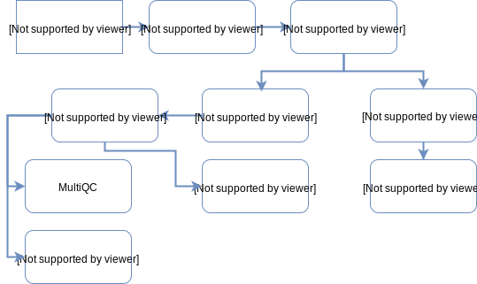
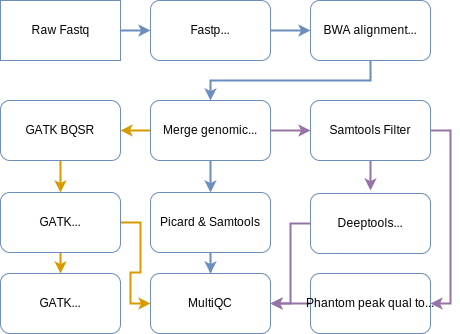

# Alignment QC
## Table of Contents
* [Overview](#overview)
  * [List of supported library type and species](#list-of-supported-library-type-and-species)
* [QC of transcriptomic data](#qc-of-transcriptomic-data)
* [QC of genomic data](#qc-of-genomic-data)
* [QC of single cell transcriptomic data](#qc-of-single-cell-transcriptomic-data)
* [Software and version information](#software-and-version-information)
* [Command line](#command-line)
  * [Read preprocessing](#read-preprocessing)
    * [Adapter trimming](#adapter-trimming)
  * [Read alignment](#read-alignment)
    * [Genomic DNA alignment](#genomic-dna-alignment)
    * [RNA-Seq alignment](#rna-seq-alignment)
  * [Post-alignment processing](#post-alignment-processing)
      * [Add Read Group tags](#add-read-group-tags)
      * [Mark duplicate reads](#mark-duplicate-reads)
  * [Signal bigwig](#signal-bigwig)
    * [Epigenome signal bigwig](#epigenome-signal-bigwig)
    * [Transcriptome signal bigwig](#transcriptome-signal-bigwig)
  * [Transcriptome specific analysis](#transcriptome-specific-analysis)
    * [Expression quantification](#expression-quantification)
  * [Epigenome quality check](#epigenome-quality-check)
    * [Strand cross-correlation metrics](#strand-cross-correlation-metrics)
    * [Sequence coverage](#sequence-coverage)
    * [Epigenome quality fingerprint](#epigenome-quality-fingerprint)
  * [WGS post alignment processing](#wgs-post-alignment-processing)
    * [GATK BaseRecalibrator](#gatk-baserecalibrator)
    * [GATK ApplyBQSR](#gatk-applybqsr)
    * [GATK BaseRecalibrator post ApplyBQSR](#gatk-baserecalibrator-post-applybqsr)
    * [GATK HaplotypeCaller GVCF](#gatk-haplotypecaller-gvcf)
* [Output format](#output-format)
  * [Alignment file](#alignment-file)
  * [Gene count files](#gene-count-files)
  * [Signal files](#signal-files)
  * [Strand cross-correlation pdf](#strand-cross-correlation-pdf)
  * [GVCF](#gvcf)
  * [MultiQC report](#multiqc-report)
* [List of resources](#list-of-resources)
* [Change logs](#change-logs)

## Overview
We process sequencing data through our QC pipeline and generate alignment quality report for a variety of assay types. A list of supported library types and species information can be found below.

### List of supported library type and species

  <table class="table table-hover">
    <thead style="font-weight:bold;">
      <tr class="table-light">
        <td scope="col">Library type</td>
        <td scope="col">Species</td>
      </tr>
    </thead>
    <tbody>
      <tr>
        <td>PolyA-RNA / Total-RNA</td>
        <td>Human</td>
      </tr>
      <tr>
        <td>ChIP-Seq</td>
        <td>Human</td>
      </tr>
      <tr>
        <td>ATAC-Seq</td>
        <td>Human</td>
      </tr>
      <tr>
        <td>Single cell 3' RNA (10X Genomics)</td>
        <td>Human</td>
      </tr>
      <tr>
        <td>WGS</td>
        <td>Human</td>
      </tr>
       </tbody>
  </table>

<a href="#table-of-contents">Go to Top</a>

## QC of transcriptomic data
Sequencing data for RNA-Seq samples are adapter trimmed using Fastp and mapped against a reference transcriptome using splice aware aligner STAR. We follow the _Alternate Protocol 7_ from [Mapping RNA-seq Reads with STAR](https://www.ncbi.nlm.nih.gov/pmc/articles/PMC4631051/) and generate both genomic and transcriptomic bam files after aligning fastq files from different lanes and flowcells. Each lane level bams are tagged with relevant read group information before they are merged together to create a library level bam followed by marking the duplicate reads (without removal) using Picard tool. We generate raw counts per gene using the FeatureCounts tool from the merged genomic bam. Also, normalised counts are generated using RSEM tool from the merged transcriptome bam. A bigwig signal file is generated from the genomic bam file using STAR, following the _Alternate Protocols 4_ from the above mentioned publication. All the Picard and Samtools metrics are merged using MultiQC for a library level report.

  

<a href="#table-of-contents">Go to Top</a>

## QC of genomic data
Sequencing data for genomic samples are adapter trimmed using Fastp and mapped against a reference genome using alignment tool BWA. We follow GATK's [Data pre-processing for variant discovery](https://software.broadinstitute.org/gatk/best-practices/workflow?id=11165)  document and post process the raw alignment. Each lane level bams are tagged with relevant read group information before they are merged to a library level bam, after which duplicate reads are marked. We generate Picard and Samtools metrics for the library level bam and combine them using MultiQC. For the epigenome assays (purple arrow), we generate few additional metrics using [Phantompeakqualtools](https://www.encodeproject.org/software/phantompeakqualtools/) and [deepTools](https://deeptools.readthedocs.io/en/develop/) and add them to the same MultiQC report. For WGS samples (orange arrow), we process the duplicate marked bams with [GATK](https://gatk.broadinstitute.org/) BaseRecalibrator and ApplyBQSR before generating per sample GVCF files using HaplotypeCaller tool.

  

<a href="#table-of-contents">Go to Top</a>

## QC of single cell transcriptomic data
Please check the [Single Cell Transcriptome Analysis](sc_transcriptome.html) page for more details.

## Software and version information
  * [Fastp v0.20.1](https://github.com/OpenGene/fastp)
  * [STAR v2.6.0a](https://github.com/alexdobin/STAR) 
  * [BWA v0.7.17](http://bio-bwa.sourceforge.net/)
  * [RSEM v1.3.1](https://deweylab.github.io/RSEM/)
  * [FeatureCounts v1.6.4](http://bioinf.wehi.edu.au/featureCounts/)
  * [Picard v2.19](https://broadinstitute.github.io/picard/command-line-overview.html)
  * [Samtools v1.9](http://www.htslib.org/)
  * [MultiQC v1.9](https://multiqc.info/)
  * [Phantompeakqualtools v1.2.0](https://www.encodeproject.org/software/phantompeakqualtools/)
  * [deepTools v3.2.1](https://deeptools.readthedocs.io/en/develop/)
  * [GATK v4.1.4.1](https://gatk.broadinstitute.org/)

<a href="#table-of-contents">Go to Top</a>

## Command line

### Read preprocessing

#### Adapter trimming

Tool name: __Fastp__

  <pre><code>
  fastp
    -a auto
    --in1 /path/input/sample.R1.fastq.gz
    --out1 /path/trimmed/sample.R1.fastq.gz
    --html /path/trimmed/sample.report.html
    --json /path/trimmed/sample.report.json
    --report_title sample
    --thread threads
    --in2 /path/input/sample.R2.fastq.gz
    --out2 /path/trimmed/sample.R2.fastq.gz
    --qualified_quality_phred=15
    --length_required=15
    --trim_poly_g         # for NEXTSEQ
  </code></pre>

<a href="#table-of-contents">Go to Top</a>

### Read alignment

#### Genomic DNA alignment

Tool name:  __BWA__

  <pre><code>
  bwa
    mem
    -t threads 
    -M
    /path/bwa_ref_genome
    /path/trimmed/sample.R1.fastq.gz /path/trimmed/sample.R2.fastq.gz | samtools view -bo aligned.bam -
  </code></pre>
 

#### RNA-Seq alignment

Tool name: __STAR__

  <pre><code>
  STAR
    --runThreadN threads
    --outFileNamePrefix /path/mapped/sample
    --outSAMattributes NH HI AS NM MD
    --runMode alignReads
    --outFilterType BySJout
    --quantMode TranscriptomeSAM GeneCounts
    --sjdbGTFfile gene.gtf
    --genomeLoad NoSharedMemory
    --outSAMunmapped Within
    --outSAMtype BAM SortedByCoordinate
    --genomeDir /path/star_ref_transcriptome
    --outFilterMultimapNmax 20
    --alignIntronMin 20
    --alignSJDBoverhangMin 1
    --outFilterMismatchNoverReadLmax 0.04
    --alignMatesGapMax 1000000
    --limitBAMsortRAM 12000000000
    --outFilterMismatchNmax 999
    --alignIntronMax 1000000
    --alignSJoverhangMin 8
    --twopassMode Basic
    --readFilesCommand zcat
    --readFilesIn /path/trimmed/sample.R1.fastq.gz /path/trimmed/sample.R2.fastq.gz
  </code></pre>

<a href="#table-of-contents">Go to Top</a>

### Post-alignment processing

#### Add Read Group tags

Tool name: __Picard AddOrReplaceReadGroups__

  <pre><code>
  java
    -XX:ParallelGCThreads=threads
    -XmxMg
    -Djava.io.tmpdir=/path/temp
    -jar picard.jar
    AddOrReplaceReadGroups
    RGPL=PLATFORM
    RGPU=UNIQUE_RG_PU
    RGLB=LIBRARY_ID
    SORT_ORDER=coordinate # or unsorted for STAR transcriptome BAM
    RGSM=SAMPLE_ID
    RGCN=CENTER_NAME
    RGID=UNIQUE_RG_ID
    I=/path/mapped/sampleAligned.sortedByCoord.out.bam
    O=/path/mapped/sampleAligned.sortedByCoord.out.AddOrReplaceReadGroups.bam
  </code></pre>

#### Mark duplicate reads

Tool name: __Picard Mark duplicates__

  <pre><code>
  java
    -XX:ParallelGCThreads=thread
    -XmxMg
    -Djava.io.tmpdir=/path/temp
    -jar picard.jar
    MarkDuplicates
    O=/path/mapped/sample.genome.MarkDuplicates.bam
    M=/path/mapped/sample.genome.MarkDuplicates.summary.txt
    OPTICAL_DUPLICATE_PIXEL_DISTANCE=2500                   # for HISEQ 4000 and NextSeq
    I=/path/mapped/sampleAligned.sortedByCoord.out.AddOrReplaceReadGroups.bam
  </code></pre>

<a href="#table-of-contents">Go to Top</a>

### Signal bigwig

#### Epigenome signal bigwig

Tool name: __deepTools bamCoverage__

  <pre><code>
  bamCoverage
    --bam filtered.bam
    --outFileFormat bigwig
    --outFileName bam_cov.bw
    --blackListFileName /ENCODE/ENCFF419RSJ.bed
    --numberOfProcessors threads
  </code></pre>

#### Transcriptome signal bigwig

Tool name: __STAR bigwig__

  <pre><code>
  STAR
    --runThreadN threads
    --runMode inputAlignmentsFromBAM
    --outFileNamePrefix /path/signal/sample
    --genomeLoad NoSharedMemory
    --outWigType bedGraph
    --outWigStrand Stranded
    --inputBAMfile /path/mapped/sample.genome.MarkDuplicates.bam
  </code></pre>

<a href="#table-of-contents">Go to Top</a>

### Transcriptome specific analysis

#### Expression quantification

Tool name: __FeatureCounts__

  <pre><code>
  featureCounts
    -a genes.gtf
    -o /path/output
    -T threads
    /path/mapped/sample.genome.MarkDuplicates.bam
  </code></pre>

Tool name: __RSEM__

  <pre><code>
  rsem-calculate-expression
    --quiet
    --no-bam-output
    --alignments
    --strandedness reverse
    --num-threads threads
    --ci-memory 4000
    --estimate-rspd
    --paired-end 
    /path/mapped/sample.merged.transcriptome.bam
    RSEM_REF
    /path/rsem/sample
  </code></pre>

<a href="#table-of-contents">Go to Top</a>

### Epigenome quality check

#### Filter alignment

Tool name: __Samtools__

  <pre><code>
  samtools view
   -q 20
   -F 1804   ## For PE, or 1796 for SE
   -bo filtered.bam
   raw_input.bam
  </code></pre>

#### Strand cross-correlation metrics

Tool name: __Phantompeakqualtools__

  <pre><code>
  Rscript phantompeakqualtools/run_spp.R
   -c=filtered.bam
   -rf
   -p=threads
   -savp=PPQT.spp.pdf
   -out=PPQT.spp.out
   -odir=/path/output
  </code></pre>

#### Sequence coverage

Tool name: __deepTools plotCoverage__

  <pre><code>
  plotCoverage
    -b filtered.bam
    -p threads
    --blackListFileName /ENCODE/ENCFF419RSJ.bed
    --outRawCounts coverage.tab > plot_cov.out
  </code></pre>

#### Epigenome quality fingerprint

Tool name: __deepTools plotFingerprint__

  <pre><code>
  plotFingerprint
    --bamfiles filtered.bam
    --outQualityMetrics fingerprint.m
    -p 4
    --blackListFileName /ENCODE/ENCFF419RSJ.bed
    --outRawCounts fingerprint.tab
  </code></pre>

<a href="#table-of-contents">Go to Top</a>

### WGS post alignment processing

#### GATK BaseRecalibrator

  <pre><code>
  gatk 
    BaseRecalibrator 
      -I /path/sample.MarkDuplicates.bam 
      -O /path/sample.MarkDuplicates.bam_BaseRecalibrator.table 
      --reference /path/fasta
      --java-options '-XX:ParallelGCThreads=1 -Xmx8g -Djava.io.tmpdir=/tmpdir'
      --known-sites /path/dbsnp.vcf 
      --known-sites /path/known_indels.vcf.gz
  </code></pre>

#### GATK ApplyBQSR

  <pre><code>
  gatk
    ApplyBQSR
      --bqsr-recal-file /path/sample.MarkDuplicates.bam_BaseRecalibrator.table
      --create-output-bam-index
      --emit-original-quals
      -I /path/sample.MarkDuplicates.bam 
      -O /path/sample.MarkDuplicates_ApplyBQSR.bam 
      --reference /path/fasta 
      --java-options '-XX:ParallelGCThreads=1 -Xmx8g -Djava.io.tmpdir=/tmpdir'
  </code></pre>

#### GATK BaseRecalibrator (post ApplyBQSR)

  <pre><code>
  gatk
    BaseRecalibrator
      -I /path/sample.MarkDuplicates_ApplyBQSR.bam
      -O /path/sample.MarkDuplicates_ApplyBQSR.bam_BaseRecalibrator.table
      --reference /path/fasta
      --java-options '-XX:ParallelGCThreads=1 -Xmx8g -Djava.io.tmpdir=/tmpdir'
      --known-sites /path/dnsnp.vcf
      --known-sites /path/known_indels.vcf.gz
  </code></pre>

#### GATK HaplotypeCaller GVCF

  <pre><code>
  gatk
    HaplotypeCaller
    -I /path/sample.MarkDuplicates_ApplyBQSR.bam
    -O /path/sample.MarkDuplicates_ApplyBQSR_HaplotypeCaller.g.vcf.gz
    --reference /path/fasta
    --dbsnp /path/dbsnp.vcf
    --java-options '-XX:ParallelGCThreads=1 -Xmx8g -Djava.io.tmpdir=/tmpdir'
    --emit-ref-confidence GVCF
  </code></pre>

<a href="#table-of-contents">Go to Top</a>

## Output format

### Alignment file
  * __Cram__: Per sample cram file. Chech the [Reference genome datasets](ref_genome.html) page for details about the reference genome build used for cram conversion.
  
### Gene count files
  * __FeatureCounts__: Raw read counts per gene
  * __RSEM__: Normalised (TPM and RPKM) read counts per gene and isoforms
  
### Signal files
  * __STAR bigwig__: Per sample bigwig signal file generated by STAR
  * __deepTools bigwig__: Per sample bigwig signal file generated by deepTools bamCoverage

### Strand cross-correlation pdf
  * __Phantompeakqualtools pdf__: Strand cross-correlation plot with NSC and RSC metrics

### GVCF
  * __GATK HaplotypeCaller GVCF__: Per sample GVCF file produced by GATK HaplotypeCaller

### MultiQC report

A multiqc report for the alignment bam is produced (per sample) combining metrics from the following tools

* __Fastp__
* __STAR__ (RNA-Seq)
* __Picard Mark Duplicates__
* __Picard CollectAlignmentSummaryMetrics__
* __Picard CollectBaseDistributionByCycle__
* __Picard CollectGcBiasMetrics__
* __Picard QualityScoreDistribution__
* __Picard CollectRnaSeqMetrics__ (RNA-Seq)
* __Samtools idxstats__
* __Samtools stats__
* __FeatureCounts__ (RNA-Seq)
* __Phantompeakqualtools__ (Epigenome)
* __deepTools__ (Epigenome)
* __GATK BQSR (pre and post ApplyBQSR)__ (WGS)

<a href="#table-of-contents">Go to Top</a>

## List of resources
  * [Fastp](https://github.com/OpenGene/fastp)
  * [STAR](https://github.com/alexdobin/STAR)
  * [Picard](https://broadinstitute.github.io/picard/command-line-overview.html)
  * [BWA](http://bio-bwa.sourceforge.net/bwa.shtml)
  * [FeatureCounts](http://bioinf.wehi.edu.au/featureCounts/)
  * [RSEM](https://deweylab.github.io/RSEM/)
  * [Phantompeakqualtools](https://www.encodeproject.org/software/phantompeakqualtools/)
  * [deepTools](https://deeptools.readthedocs.io/en/develop/)
  * [GATK](https://gatk.broadinstitute.org/)

<a href="#table-of-contents">Go to Top</a>

## Change logs

* 29 January 2021
  * Moved to Gencode v36 build from v30
  * Updated Fastp from v0.19.8 to v0.20.1
* 20 December 2020
  * Updated MultiQC from v 1.7 to v 1.9
* 03 January 2020
  * Added WGS post alignment processing by GATK
  * Added GATK HaplotypeCaller GVCF generation for WGS samples
* 25th June 2019
  * Added epigenome specific metrics
  * Added "-a auto" flag to Fastp command
  * Moved to Gencode v30 build from v28
* 24th April 2019
  * Updated MultiQC from v 1.6 to v 1.7
  * Updated Fastp from v 0.19.3 to v 0.19.8
  * Added metrics from Samtools stats and removed Samtools flagstat

