# Table of Contents
* [Project home](#project-qc-report-page)
  * [Overview](#overview)
  * [Project home](#project-home)
    * [Project data overview](#project-data-overview)
      * [Navigate to project data page](#navigate-to-project-data-page)
      * [List of sequencing runs](#list-of-sequencing-runs)
      * [Project with single sequencing run (column plot)](#project-with-single-sequencing-run-column-plot)
      * [Project with single sequencing run (histogram plot)](#project-with-single-sequencing-run-histogram-plot)
      * [Project with multiple sequencing runs (column plot)](#project-with-multiple-sequencing-runs-column-plot)
      * [Project with multiple sequencing runs (histogram plot)](#project-with-multiple-sequencing-runs-histogram-plot)
    * [Project status](#project-status)
    * [Analysis reports](#analysis-reports)
  * [Run home](#run-home)
    * [Nevigate to Run home](#nevigate-to-run-home)
    * [Lane level qc reports](#lane-level-qc-reports)
    * [Sample level qc reports](#sample-level-qc-reports)
    * [Undetermined reads](#undetermined-reads)
      * [Nevigate to undetermined read qc page](#nevigate-to-undetermined-read-qc-page)
      * [Lane level qc for undetermined reads](#lane-level-qc-for-undetermined-reads)

# Project QC Report Page

## Overview
QC report pages are designed to combine metrices from sequencing raw data as well as primary alignment and analysis runs.

## Project home
This page provides a top level overview of the data availability for the project and required links for individual sequencing runs, project status description and analysis report page.

### Project data overview
This page describe raw data information for the project.

#### Navigate to project data page
Click on 'Project Home' from the nevigation tab present on the top
e.g.

  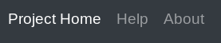

or

  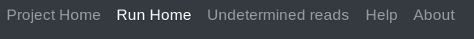

Then select specific page from left side menu

  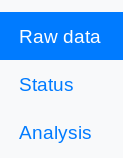

#### List of sequencing runs
This section of the project home page provides links to the individual sequencing runs.

  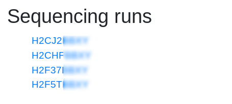

#### Project with single sequencing run (column plot)

  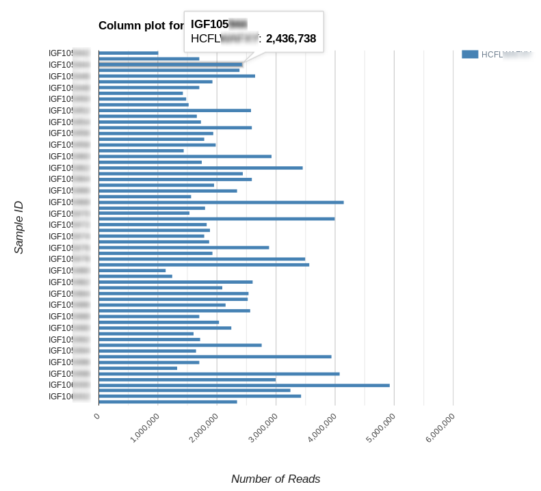

#### Project with single sequencing run (histogram plot)

  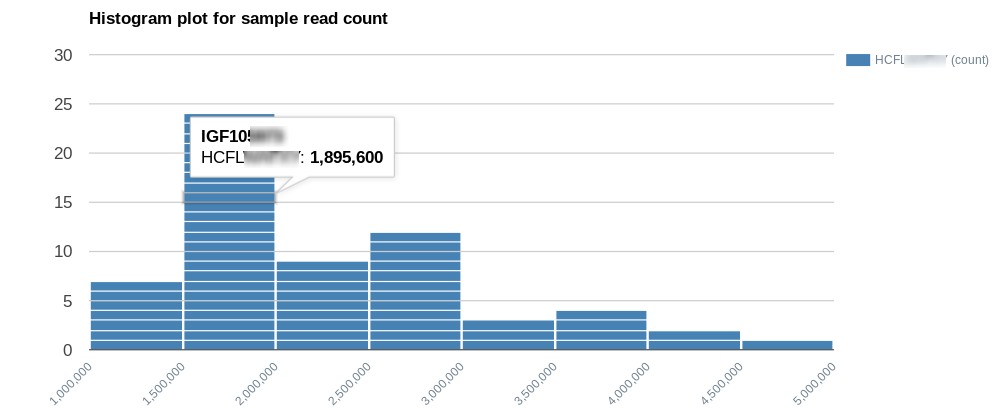

#### Project with multiple sequencing runs (column plot)

  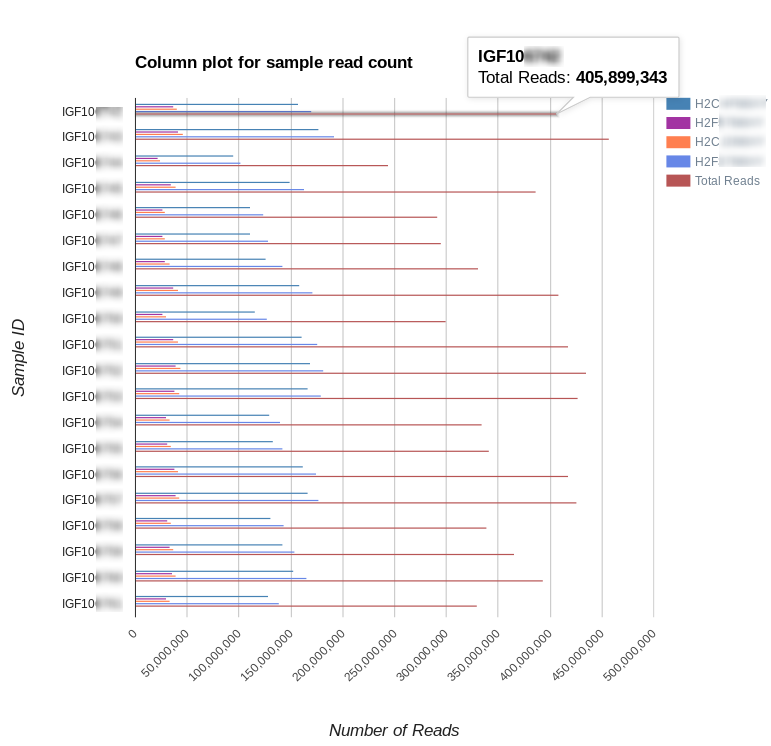

#### Project with multiple sequencing runs (histogram plot)

  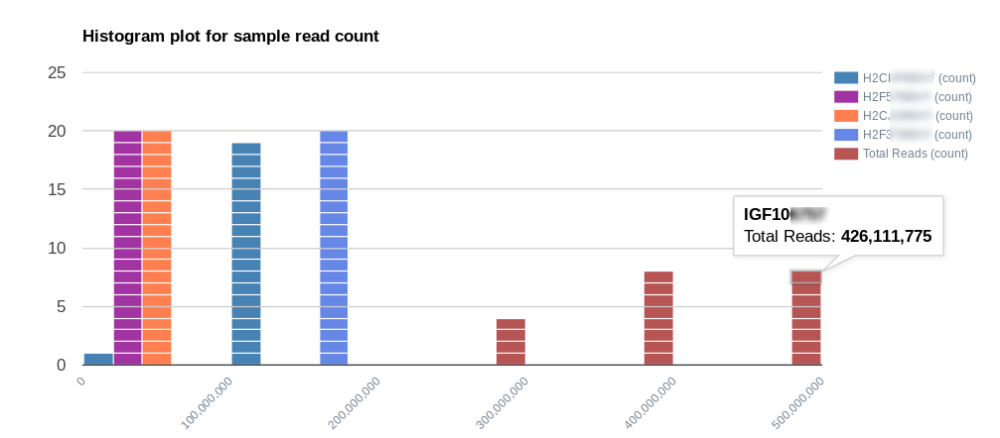

### Project status

  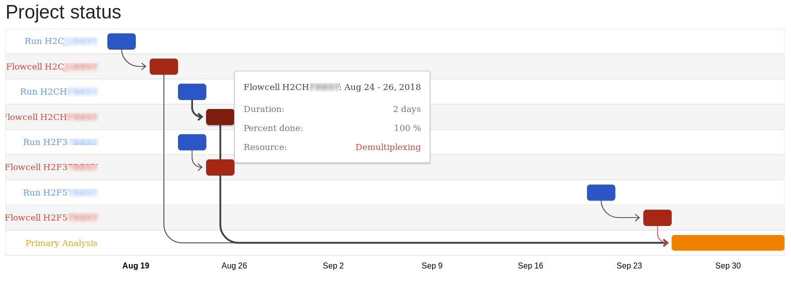

### Analysis reports

  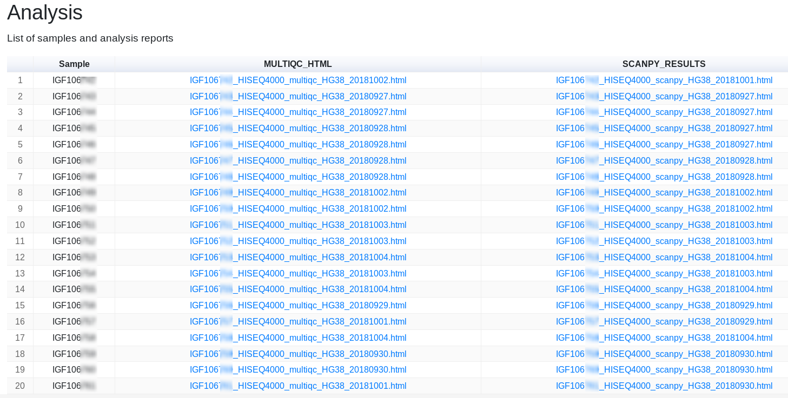

## Run home

### Nevigate to Run home
Click on the list of sequencing runs from the Project home

  

or select 'Run Home' tab from top level nav

### Lane level qc reports

 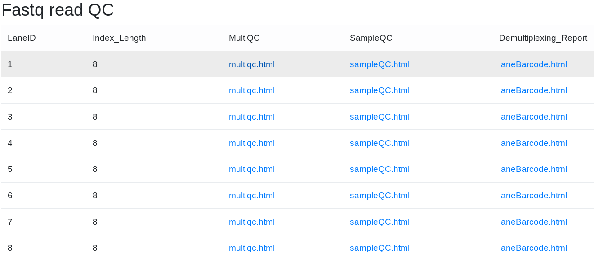

### Sample level qc reports

  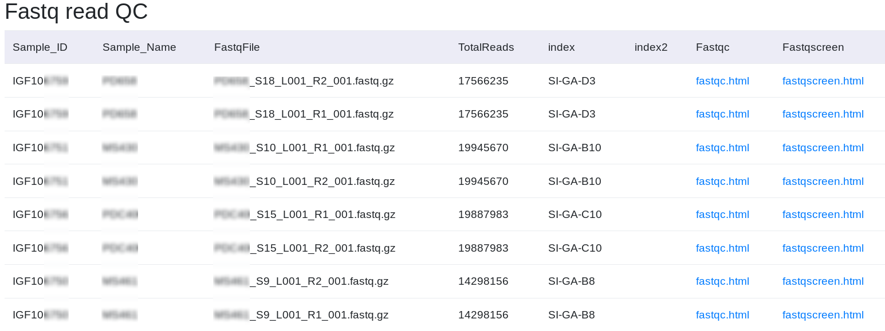

### Undetermined reads

#### Nevigate to undetermined read qc page
Click on the 'Undetermined reads' tab from top level nav

  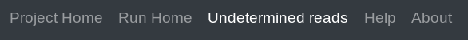

#### Lane level qc for undetermined reads

  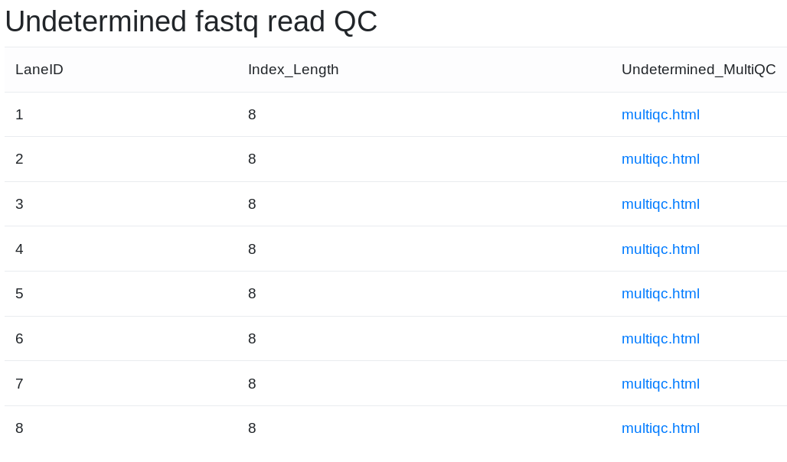

## Change log
