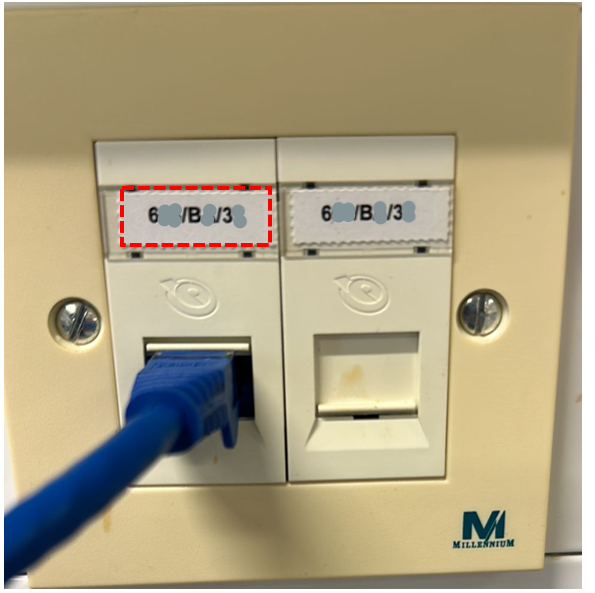

## Fix network issues for lab devices
NEXT_SLIDE
#### Table of contents

<ul>
<li><a href="#/2">Check and activate network socket</a></li>
<li><a href="#/5">Check and register new device to college network</a></li>
<li><a href="#/7">How to get MAC address</a></li>
<li><a href="#/8">How to create ICT ticket</a></li>
</ul>

NEXT_SLIDE
### Check and activate network socket

<ul>
<li>Connect a LAN cable from the network socket to a laptop</li>
<li>Make sure the laptop is already registered on college network before</li>
<li>Now look for network status of the laptop</li>
<li>Laptop will be connected to internet if the network socket if active</li>
<ul>

NEXT_SLIDE
### Check and activate network socket - cont.

NEXT_SLIDE
### Check and activate network socket - cont.

Login to <a href="https://www.imperial.ac.uk/admin-services/ict/contact-ict-service-desk/">ASK ICT</a> and create a new ticket quoting the network socket id for the network socket

NEXT_SLIDE
### Check and register new device to college network

<ul>
<li>Connect new device to an active network port via a LAN cable. Go back to the previous step if it doesn't show any available network</li>
<li>Once its connected to the local area network, check if its connected to internet or not</li>
<li>New device has to be registered on college network if its not connected to internet even though its connected to local network</li>
NEXT_SLIDE
### Check and register new device to college network - cont.
<li>Create a new ticket quoting the following details:</li>
<pre><code>
  - Who will be the person responsible for the server?
  - What OS is it running?
  - What is the equipment manufacturer and model?
  - Where its located?
  - Device MAC address?
  - Wall socket ID?
</code></pre>

NEXT_SLIDE
### How to get MAC address
* Windows: [MAC address or physical address location](https://answers.microsoft.com/en-us/windows/forum/all/mac-address-or-physical-address-location/e21bba7a-a443-448e-8e39-19ab55fb9db2)
* Linux(Ubuntu): [How can I see my MAC address on ubuntu](https://superuser.com/questions/164426/how-can-i-see-my-mac-address-on-ubuntu)
NEXT_SLIDE
### How to create ICT ticket
[Contact ICT service desk](https://www.imperial.ac.uk/admin-services/ict/contact-ict-service-desk/)

