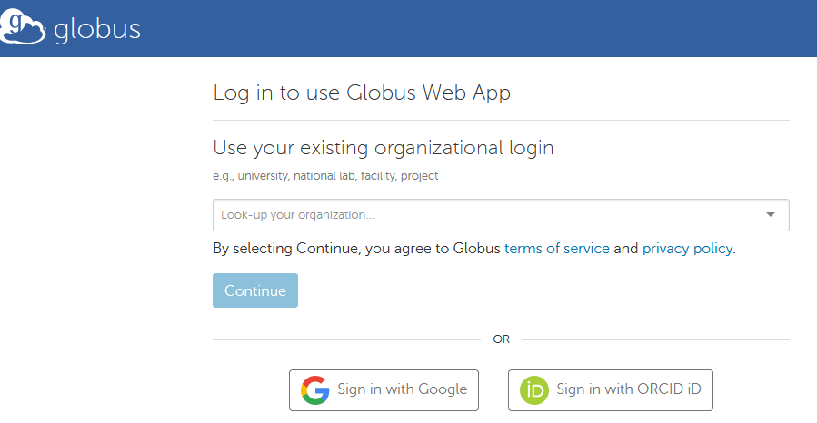

## Globus data transfer

#### Table of contents
* [What is Globus](#/2)
* [How to login to Globus account](#/3)
* [Login to Globus - for Imperial College users](#/4)
* [Login to Globus - for external users](#/5)
* [How to transfer data](#/6)
* [Transfer data to your computing cluster](#/7)
* [Transfer data to your Personal Computer using Globus](#/8)

## What is Globus
Globus is a non-profit service for secure, reliable research data management. With Globus, subscribers can move, share, & discover data via a single interface – whether your files live on a supercomputer, lab cluster, tape archive, public cloud or your laptop, you can manage this data from anywhere, using your existing identities, via just a web browser.
*  Visit [https://www.globus.org](https://www.globus.org)

## How to login to Globus account
* [For Imperial College users](#/3)
* [For external users](#/4)

### Login to Globus - for Imperial College users
Check the following Wiki page maintained by Imperial College's RCS team
* [Transferring data to other sites with Globus](https://wiki.imperial.ac.uk/display/HPC/Globus)

### Login to Globus - for external users
<ul>
<li>Option 1: Use your existing organizational login</li>
<li>Option 2: Use Google or ORCID id</li>
</ul>

## How to transfer data
* [Transfer data to your computing cluster](#/7)
* [Transfer data to your Personal Computer using Globus](#/8)

### Transfer data to your computing cluster

Check the following links
<ul>
<li>For Imperial College users: Transferring data to other sites with Globus</li>
<li>For external users: <a href="https://docs.globus.org/how-to/share-files/">How To Share Data Using Globus</a></li>
</ul>

### Transfer data to your Personal Computer using Globus

"For transferring data to your own computer, or another resource that doesn't have its own Globus endpoint, you will need to install Globus Connect Personal. This creates a Globus endpoint on your personal computer, allowing you to move data using the Globus web app."

Check these links for installing, configuring, and uninstalling Globus Connect Personal on:

<ul>
<li><a href="https://docs.globus.org/how-to/globus-connect-personal-mac">Mac OS X</a></li>
<li><a href="https://docs.globus.org/how-to/globus-connect-personal-windows">Windows</a></li>
<li><a href="https://docs.globus.org/how-to/globus-connect-personal-linux">Linux</a></li>
</ul>

