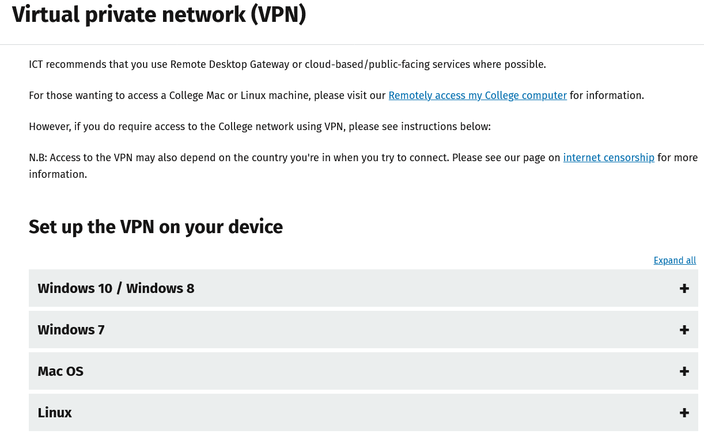
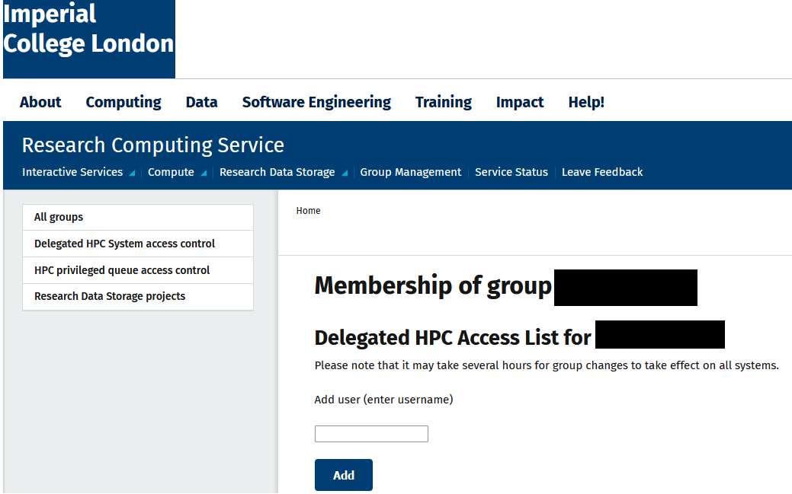
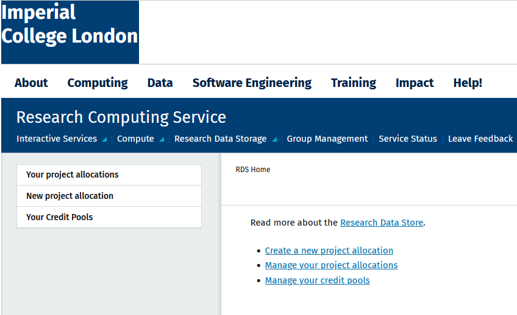
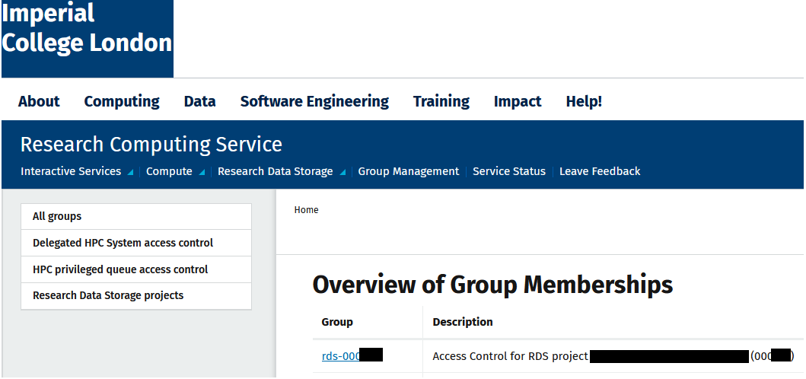
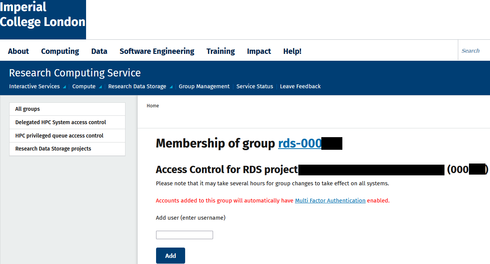

## Setting-up RDS project allocation

#### Table of contents
* [Research Data Store (RDS)](#/2)
* [Quick links](#/3)
* [What you need ?](#/4)
* [Set-up VPN](#/5)
* [Steps for setting up RDS storage (for PIs)](#/6)
* [Optional steps](#/11)
* [Add or remove user IGF](#/12)

#### Research Data Store (RDS)
* Imperial College's central service for storing large volumes of research data
* Each separate funded research project is eligible for 2TB of online storage free of charge

#### Quick links
* [RCS website](https://www.imperial.ac.uk/admin-services/ict/self-service/research-support/rcs/service-offering/rds/)
* [RDS config page](https://selfservice.rcs.imperial.ac.uk/groups/manage/rds/)
* [IGF help page](https://imperial-genomics-facility.github.io/igf-pipeline-help/data_access.html)
* [RDS help page](https://icl-rcs-user-guide.readthedocs.io/en/latest/rds/)

#### What you need ?
A unique entry from the college's grant management system
i.e., a project account with a P or PS code (or non-project GL accounts)

#### Set-up VPN

You have to set-up <a href="https://www.imperial.ac.uk/admin-services/ict/self-service/connect-communicate/remote-access/virtual-private-network-vpn/">Virtual private network (VPN)</a> if you are trying to connect or configure RDS from outside Imperial College's network.

#### Steps for setting up RDS storage (for PIs)
* Register for an [HPC account](https://selfservice.rcs.imperial.ac.uk/registration/hpc)
  * Check [RCS website](https://www.imperial.ac.uk/admin-services/ict/self-service/research-support/rcs/get-access/) for more details
* Add members to your [HPC group](https://selfservice.rcs.imperial.ac.uk/groups/manage/hpc-access/)
* Register for a [RDS project allocation](https://selfservice.rcs.imperial.ac.uk/rds)
* Add your [group member](https://selfservice.rcs.imperial.ac.uk/groups/manage/rds/) to the RDS project

##### Register and add members to your [HPC group](https://selfservice.rcs.imperial.ac.uk/groups/manage/hpc-access/)

##### Register for a [RDS project allocation](https://selfservice.rcs.imperial.ac.uk/rds)

##### Add your [group member](https://selfservice.rcs.imperial.ac.uk/groups/manage/rds/) to the RDS project - part-1

##### Add your [group member](https://selfservice.rcs.imperial.ac.uk/groups/manage/rds/) to the RDS project - part-2

#### Optional steps
* Turn on billing
  * Required if your are going to exceed the free storage allocation (2TB)
* Go to [RDS project page](https://api.rcs.imperial.ac.uk/rds/manage/projects)
* Check the billing option settings
* Check the "Edit details" page and see if 'Monthly payment' is turned on

#### Add or remove user IGF to [RDS group](https://selfservice.rcs.imperial.ac.uk/groups/manage/rds/)
* **Skip this step if you are using Globus based transfer**
* Add Imperial BRC Genomics Facility __(username: igf)__ as a new member of the RDS project allocation (when required)
* Remove user __igf__ from the RDS allocation when all data transfer is over
* Check our [help page](https://imperial-genomics-facility.github.io/igf-pipeline-help/data_access.html#imperial-college-research-data-store-based-transfer) for more details